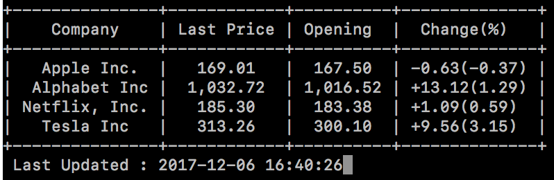

# stockshow
Show tabular stock data pulled from google finance

# installing prettytable:
    sudo easy_install prettytable

# installing alpha_vantage
    pip install alpha_vantage

# Running the script :
    python stockshow.py -f <filename>
    python stockshow.py -l <list of company stock codes>

    Press F1 to quit the window
# Example
    stockshow python stockshow.py -l AAPL GOOGL NFLX TSLA
<<<<<<< HEAD

=======
    
>>>>>>> 39218de8b12035ed3250b391816cd59d5facdf50

# Alpha vantage
    Google seemed to be performing slow and also kicked me out of using their service as I was sending 5 requests a second. 
    So tried the ALPHA vantage API. This was worse than google in performance. I have defaulted the code to still use google finance,
    but if you want to try ALPHA Vantage change the source global var to 'ALPHA' and also get an api key from https://www.alphavantage.co/support/#api-key
    Also changing the sleep time to 1.7 seconds to see if google is okay with that refresh rate and also to abide by alpha vantage's limit of requests

